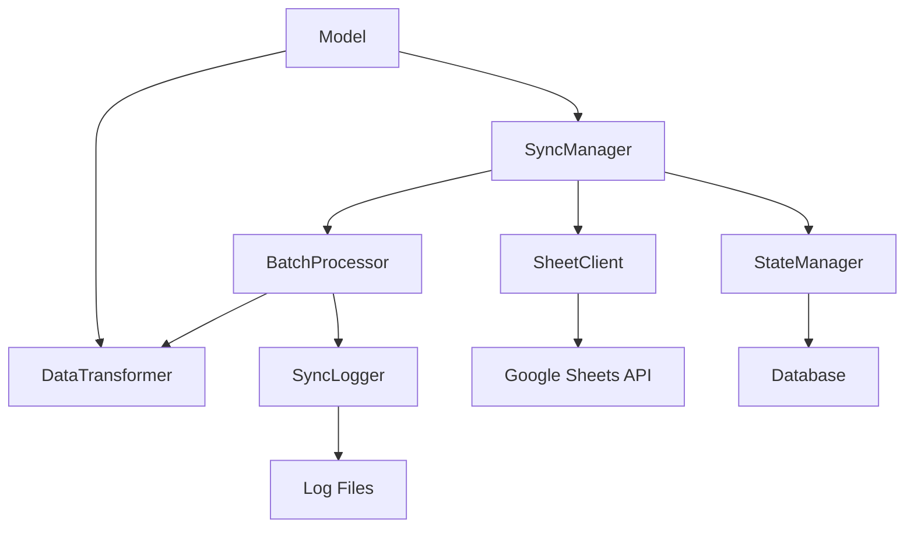
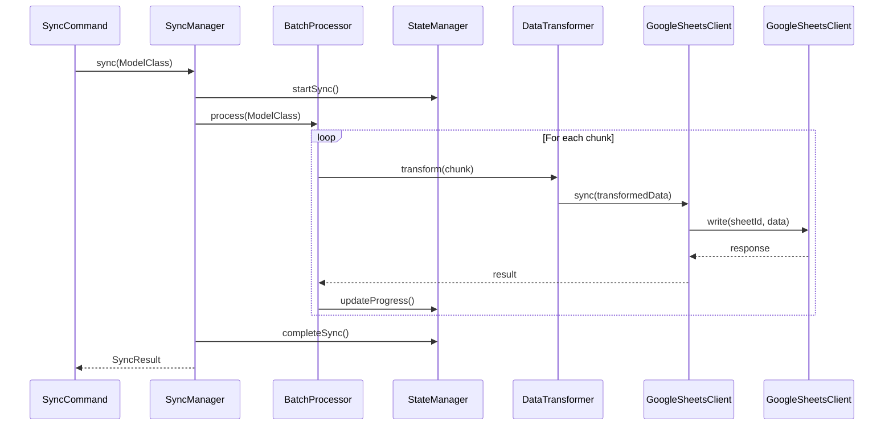

# Component Overview

This document describes the components used in this package. A minimal diagram also provides to illustrate the flow and mind-set at package built-stage.
Namespace: `Zuko\SyncroSheet`
Composer package name: `zuko/syncro-sheet`
Laravel compatible provider: \Zuko\SyncroSheet\LaravelSyncroSheetProvider

# Component List & Summary

### 1. Core Components

#### `SyncManager` (Main Orchestrator)
- Primary entry point for sync operations
- Coordinates between all other components
- Handles high-level error management
- Ensures proper sync state tracking

#### `SheetSyncable` (Interface)
- Contract for models that can be synced
- Defines required configuration methods
- Provides data transformation rules
```php
interface SheetSyncable
{
    public function getSheetIdentifier(): string;    // Google Sheet ID
    public function getSheetName(): string;          // Sheet name
    public function toSheetRow(): array;             // Data transformation
    public function getBatchSize(): int;             // Optional, defaults to 1000
}
```

### 2. Data Processing Components

#### `BatchProcessor`
- Manages chunked data processing
- Uses Laravel's lazy loading for memory efficiency
- Reports progress to state manager
- Handles chunk-level errors

#### `DataTransformer`
- Converts model data to sheet rows
- Handles data type conversions
- Manages date/time formatting
- Optional custom transformers support

### 3. State Management Components

#### `StateManager`
- Tracks sync progress and status
- Manages sync history
- Provides resume capability
- Stores performance metrics
- more sophisticated state tracking system that can handle both full and partial syncs while maintaining the sync history of individual records

#### `SyncState` (Model)
```php
// Used for tracking sync state of one sync call
class SyncState extends Model
{
    protected $fillable = [
        'model_class',      // Model class name
        'sync_type',        // 'full' or 'partial'
        'sync_mode',        // 'append' or 'replace'
        'status',           // 'running', 'completed', 'failed'
        'started_at',
        'completed_at',
        'total_processed',
        'last_processed_id',
    ];
}

// Used for tracking individual records
class SyncEntry extends Model
{
    protected $fillable = [
        'model_class',
        'record_id',
        'synced_at',
        'sync_state_id',    // Reference to parent SyncState
        'sync_type',        // 'full' or 'partial'
        'status'            // 'success' or 'failed'
    ];

    protected $casts = [
        'synced_at' => 'datetime'
    ];
}```

### 4. Google Sheets Integration

#### `SheetClient` (Wrapper around revolution/laravel-google-sheets)
- Manages Google Sheets connections
- Handles authentication
- Provides sheet operations interface
- Manages API rate limits

### 5. Logging & Monitoring

#### `SyncLogger`
- Dedicated logging channel
- Structured log format
- Performance logging
- Error tracking

#### `Events`
```php
class Events
{
    const SYNC_STARTED = 'sheet-sync.started';
    const CHUNK_PROCESSED = 'sheet-sync.chunk-processed';
    const SYNC_COMPLETED = 'sheet-sync.completed';
    const SYNC_FAILED = 'sheet-sync.failed';
}
```

### 6. Configuration

#### Package Config (`syncro-sheet.php`)
```php
return [
    'defaults' => [
        'batch_size' => 1000,
        'timeout' => 600,
        'retries' => 3
    ],

    'logging' => [
        'channel' => 'sheet-sync',
        'level' => 'info',
        'separate_files' => true
    ],

    'sheets' => [
        'cache_ttl' => 3600,
        'rate_limit' => [
            'max_requests' => 100,
            'per_seconds' => 60
        ]
    ]
];
```

# Component Interactions





# Flow:



