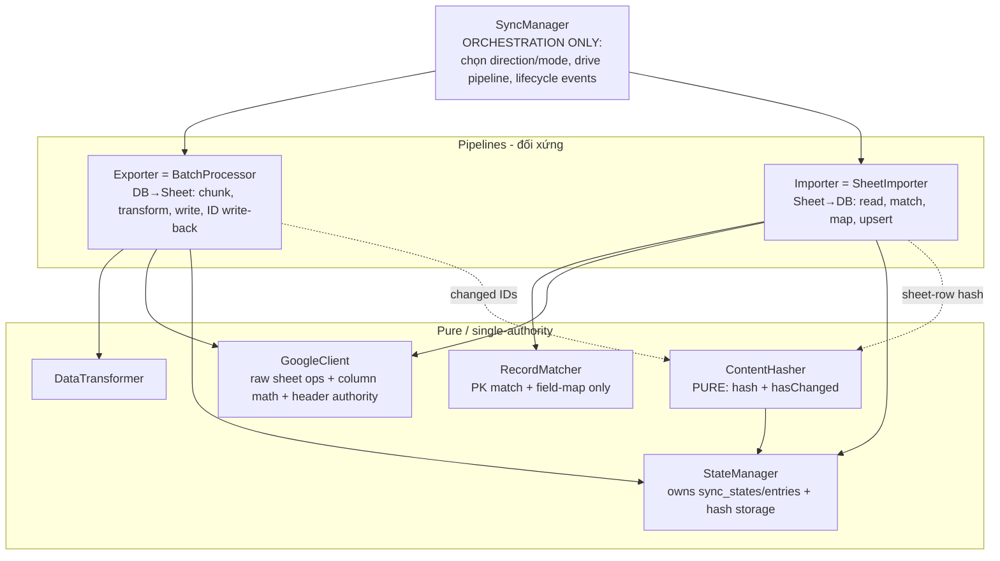

# SyncroSheet — Architecture Audit & Remediation Direction

## Context

Người dùng đang tự prototype lại thiết kế vì thấy code hiện tại đã "painful". Yêu cầu KHÔNG phải implement — mà là **architecture audit** để họ tham chiếu khi soạn design mới:

1. Đối chiếu component list gốc (`docs/COMPONENTS_OVERVIEW.md`) với code thực tế.
2. Chỉ ra components **dẫm chân nhau** (trùng trách nhiệm).
3. Chỉ ra cái gì **nằm sai chỗ** (sai layer / sai ownership).
4. List rõ + **hướng khắc phục**.

File plan này chính là báo cáo audit. Mọi finding đều đã verify bằng đọc code (file:line thực).

## Nguyên nhân gốc (một câu)

Package sinh ra **one-directional** (DB→Sheet). `bidirectional` bị bolt-on lên trên, rồi `incremental/change-detection` lại bolt-on lên trên `bidirectional` nữa. Mỗi lớp bolt-on **tự đẻ ra matching + hashing + write logic riêng** thay vì mở rộng seam có sẵn → giờ có **3 chiến lược matching, 2 cơ chế change-detection, 3 chỗ xử lý header, write-path phân tán, và 1 orchestrator phình thành God class.**

> Thẳng thắn: một phần đống lộn xộn này do chính commit `incremental sync` vừa rồi của tôi thêm vào (đánh dấu ⚠️MINE bên dưới). Đó là lý do chính đáng để user thất vọng.

---

## A. DEAD CODE — code chết, chiến lược bị bỏ giữa chừng

| Component | Trạng thái | Bằng chứng |
|---|---|---|
| `SheetRowMapper` | **Chết hoàn toàn** | Không có call site ngoài chính nó; không đăng ký trong provider. Cả một chiến lược "hash-identity" (`_record_hash` = xxh3 của identity fields) bị bỏ. |
| `FuzzyRecordIdentifier` | **Chết gián tiếp** | Chỉ được gọi bởi `SheetRowMapper` (`SheetRowMapper.php:31,33,35`) — mà cái đó đã chết. |
| `NotificationManager::notifyChunkProcessed()` + event `CHUNK_PROCESSED` | **Không bao giờ gọi** | Định nghĩa ở `NotificationManager` nhưng không có caller. |
| Facade `SyncroSheet::getLastSync()` | **Quảng cáo nhưng không tồn tại** | Docblock `Facades/SyncroSheet.php:27` khai báo `getLastSync()`, nhưng `SyncManager` không có method này → gọi vào là `BadMethodCallException`. |

**Hướng khắc phục:** Xóa `SheetRowMapper` + `FuzzyRecordIdentifier` (kèm test/reference nếu có). Xóa `notifyChunkProcessed` + hằng `CHUNK_PROCESSED` **hoặc** thực sự fire nó trong vòng lặp chunk của `BatchProcessor`. Sửa docblock facade cho khớp API thật (hoặc thêm `getLastSync()` map sang `StateManager::getLastSuccessfulSync()` đã có sẵn).

---

## B. DẪM CHÂN NHAU — trùng/chồng lấn trách nhiệm

### B1. Change-detection tồn tại **2 cơ chế song song, ngược chiều**
- `ContentHasher` (LIVE): outbound — `md5(json_encode(normalize(toSheetRow())))`, so với hash đã lưu. Dùng ở `BatchProcessor:87-89`, `SyncManager:215-218,286,309`.
- `RecordMatcher::detectChanges()` (LIVE): inbound — so sánh field-by-field `fromSheetRow` vs DB attributes (`valuesAreDifferent`). Không hash.
- Trong `processFromSheet` hai cái chạy **liền kề**: `:281` `detectChanges` quyết định ghi DB, rồi `:286` `ContentHasher` re-hash record vừa update — **không tái dùng nhau** dù cùng nằm một method.

### B2. Row-identity matching tồn tại **3 chiến lược**
- `RecordMatcher::matchByIds()` (LIVE, đúng): match bằng **PK tường minh** lưu ở `getIdColumnOnSheet()`.
- `SheetRowMapper` (chết): match bằng **hidden `_record_hash`** (xxh3).
- ⚠️MINE `SyncManager::rowMatchesSheetData()` (`:426`): match **fuzzy 70% threshold** (`$matchCount/$totalComparisons >= 0.7`, `:449`) — chiến lược thứ ba, nằm ngay trong orchestrator.

### B3. Header logic ở **3 nơi độc lập**
- `BatchProcessor::ensureHeaders()` (`:188`) — `getHeaders`; nếu rỗng thì derive từ `defaultSheetHeaders()`/`array_keys(toSheetRow())` rồi `setHeaders`.
- `GoogleClient::writeBatch()`+`generateHeaders()` (`:152-158,308`) — tự check rỗng + tự sinh header (fallback A/B/C riêng).
- `SheetReader::readSheetData()` (`:32`) — `array_shift` lấy row 0 làm header.

### B4. Sheet write-path **phân tán 2 component**
- `BatchProcessor` → `clearSheet`/`appendWithHeaders`/`writeBatch`/`setHeaders`.
- ⚠️MINE `SyncManager` → gọi thẳng `app(GoogleClient::class)`: `writeBatch` (`:241`), `updateCell` (`:387` writeBackIds, `:416` writeIdsToSheet).

**Hướng khắc phục nhóm B:**
- **Một cơ chế change-detection duy nhất = content hash, đối xứng 2 chiều.** DB→Sheet: hash `toSheetRow()`. Sheet→DB: hash chính sheet row, so với hash sheet đã lưu. `RecordMatcher::detectChanges()` **thôi làm "detector"**, chỉ còn làm **field-mapper** (đã biết row đổi → trả về attributes cần update). Bỏ `valuesAreDifferent` khỏi vai trò quyết định.
- **Một chiến lược matching duy nhất = PK tường minh** (`matchByIds`). Đây chính là lý do `getIdColumnOnSheet()` ra đời — để KHỎI phải fuzzy. Row không có ID ⇒ coi là "new", không đoán. Xóa `rowMatchesSheetData` (fuzzy) và `SheetRowMapper` (hash-identity).
- **Một authority cho header** (gợi ý: `GoogleClient` vì đã có `generateHeaders`). `BatchProcessor`/`SheetReader` chỉ *consume*, không tự derive lại.
- **Một write-path duy nhất**: mọi ghi sheet đi qua exporter (BatchProcessor / hoặc `SheetWriter` tách riêng). `SyncManager` không gọi `GoogleClient` trực tiếp.

---

## C. NẰM SAI CHỖ — sai layer / sai ownership

### C1. `SyncManager` đã thành **God class** (đáng lẽ chỉ orchestrate)
Các method low-level đang nằm sai trong orchestrator:

| Method (file:line) | Đang làm gì | Nên ở đâu |
|---|---|---|
| ⚠️MINE `processIncrementalToSheet()` `:198` | chunk records + `transformBatch` (`:237`) + `writeBatch` (`:240`) | **Trùng nguyên `BatchProcessor`.** Xóa — xem C-fix. |
| `writeBackIds()` `:333` | đọc sheet **2 lần** (`:344,:359`) + fuzzy match + `updateCell` | Exporter (BatchProcessor) |
| `writeIdsToSheet()` `:399` | tính cột + `updateCell` trực tiếp | Exporter |
| `rowMatchesSheetData()` `:426` | fuzzy matching 70% | Xóa (xem B2) |
| `columnLetterFromIndex()` `:452` | toán cột spreadsheet (0→A, 27→AB) | `GoogleClient` |
| `processFromSheet()` `:270` | inline cả pipeline Sheet→DB (update `:284`, create `:304`, write-back `:320`) | Component Importer riêng |

### C2. `ContentHasher` sở hữu nhầm việc của `StateManager`
`getStoredHash()`/`getStoredHashes()` **query thẳng bảng `sync_entries`**. Nhưng `StateManager` mới là chủ vòng đời `sync_states`/`sync_entries`. ⚠️MINE — đây là rò rỉ trách nhiệm.
**Fix:** chuyển đọc hash vào `StateManager`; `ContentHasher` thành **pure** (chỉ `hash()` + `hasChanged()`, không chạm DB).

### C3. Pipeline Sheet→DB không có nhà
`BatchProcessor` = exporter (DB→Sheet) rõ ràng. Nhưng chiều ngược lại (Sheet→DB) bị bôi vào `SyncManager::processFromSheet`. Thiếu component đối xứng.
**Fix:** tách `SheetImporter` (hoặc `BatchProcessor::processFromSheet`) đối xứng với exporter.

### C4. Incremental nên là **filter**, không phải pipeline mới
`incrementalSync` chỉ cần: hỏi hash → ra danh sách record ID đã đổi → **đẩy vào đúng path `partialSync`/exporter có sẵn**. Không tự cài lại batching. Bỏ `processIncrementalToSheet`.

---

## D. THIẾU NHẤT QUÁN (hệ quả của sai chỗ)

- **Error handling chia đôi:** `ErrorHandler` (có retry + backoff qua `PartialSyncJob`) **chỉ được gọi 1 lần** ở `fullSync` (`:84`). `partialSync`/`syncFromSheet`/`incrementalSync`/`bidirectional` dùng `handleSyncError` (`:475`) — chỉ `failSync`, **không retry, không fire `SYNC_FAILED`**.
- **API-level retry thực chất không tồn tại:** `GoogleClient` tự try/catch rồi throw, không retry. "Retry logic" chỉ ở tầng orchestration.
- **Notification không đều:** `partialSync` **không** fire start/completion. Lỗi ngoài nhánh retry-exhaustion **không** phát event nào.

**Hướng khắc phục:** mọi entry point đi qua **cùng một** error path và **cùng bộ** lifecycle event. Quyết định retry là API-level (trong GoogleClient/ErrorHandler dùng chung) hay orchestration-level, rồi áp nhất quán.

---

## Target shape (phác thảo để user cân nhắc)

Nguyên tắc rút gọn:
- **1 identity** = PK ở `idColumn` (bỏ fuzzy + `_record_hash`).
- **1 change-detection** = content hash, đối xứng 2 chiều; `detectChanges` hạ cấp thành field-mapper.
- **1 write-path**, **1 header authority**, **1 error/notification path**.
- `SyncManager` không import/gọi `GoogleClient` nữa.
- Incremental = "lọc ID đã đổi rồi gọi exporter", không phải pipeline riêng.

## Verification (khi bắt tay refactor)

- `composer test` — 42 test hiện có phải xanh sau mỗi bước tách.
- `grep -rn "app(GoogleClient::class)" src/Services/SyncManager.php` → phải rỗng (orchestrator hết gọi thẳng).
- `grep -rn "SheetRowMapper\|FuzzyRecordIdentifier" src/` → rỗng sau khi xóa.
- Thêm test: incremental chỉ đẩy record đã đổi (đã có `IncrementalSyncTest`); ID write-back đúng theo vị trí append (không fuzzy); Sheet→DB tạo record mới cho row không idCol.
- `composer lint` sạch.

## Ghi chú phạm vi

Đây là **audit + hướng đi**, chưa động code (đang plan mode). User tự soạn design; báo cáo này là input. Nếu muốn tôi thực thi một phần (vd: xóa dead code, hạ God class), nói rõ hạng mục.