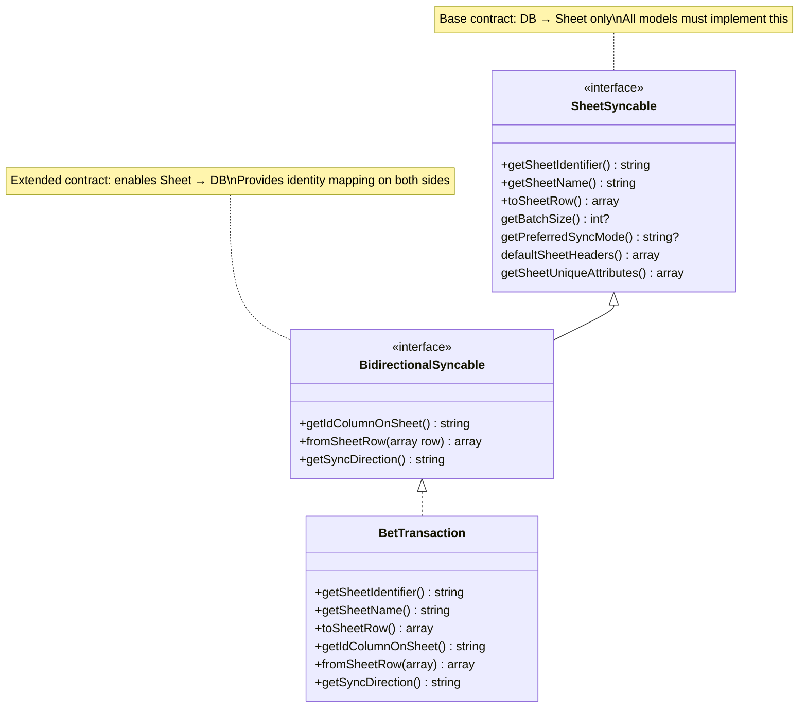
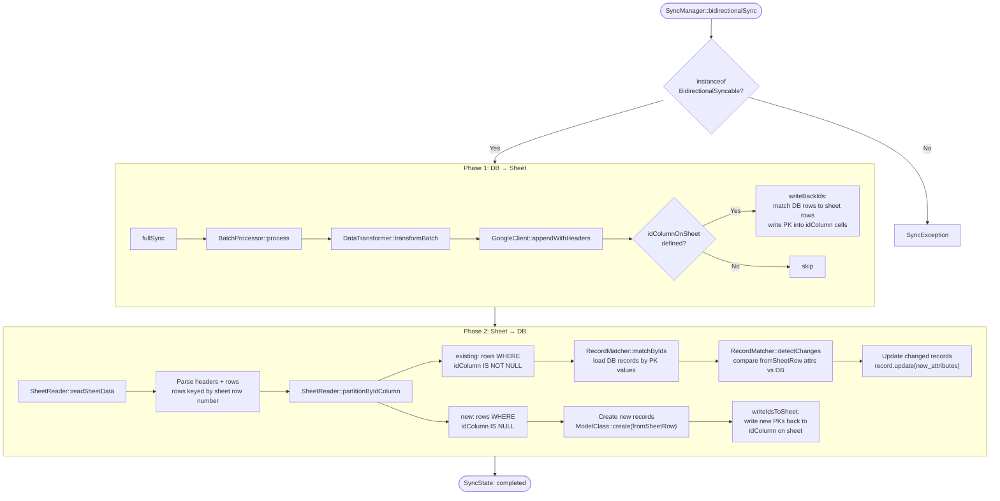
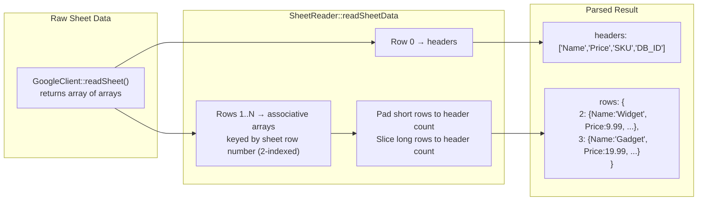
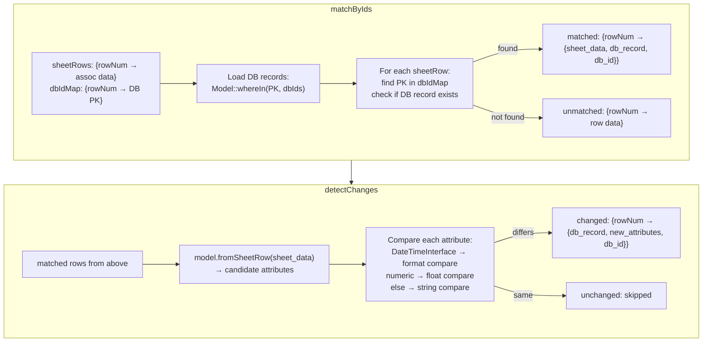

# Bidirectional Sync + Project Setup

## Requirement

1. **idColumnOnSheet**: Support defining a column on the sheet to store DB record IDs, enabling tracking of which records are synced
2. **Bidirectional sync**: Sheet → DB direction (currently only DB → Sheet)
3. **Migration renaming**: Fix nonstandard migration filenames (0_, 1_, 2_) to standard Laravel format
4. **CLAUDE.md init**: Project documentation for agent workflow
5. **Unit tests setup**: phpunit.xml + test structure + basic tests
6. **Fix missing code**: Exception classes, TokenManager::getToken()
7. **BidirectionalSyncable interface**: Formal contract for models that participate in 2-way sync

## Migration Rename Map

| Old | New |
|-----|-----|
| `0_create_sync_states_table.php` | `2025_01_01_000000_create_sync_states_table.php` |
| `1_create_sync_entries_table.php` | `2025_01_01_000001_create_sync_entries_table.php` |
| `2_create_sync_mode_column.php` | `2025_01_01_000002_add_sync_mode_to_sync_states_table.php` |

New migrations added:
- `2025_01_01_000003_add_sync_direction_to_sync_states_table.php`
- `2025_01_01_000004_add_sheet_row_number_to_sync_entries_table.php`

---

## Contract Hierarchy



**Design rationale**: `method_exists()` checks are fragile — no IDE support, no static analysis, no compile-time guarantee. `BidirectionalSyncable` formalizes the contract: if a model implements it, all 3 methods are guaranteed present. The system uses `instanceof` checks instead of `method_exists`.

### Identity Mapping

```
┌──────────────────────┐          ┌──────────────────────┐
│      Database         │          │    Google Sheet       │
│                       │          │                       │
│  PK: id (auto-incr)  │◄────────►│  Col: idColumnOnSheet │
│                       │          │  (e.g. column "X")    │
│  model attributes    │──toSheetRow()──►  row cells       │
│  model attributes    │◄─fromSheetRow()── row cells       │
└──────────────────────┘          └──────────────────────┘

getIdColumnOnSheet() = "X"  → Sheet column header storing DB PK
Model::getKeyName()  = "id" → DB primary key column (Eloquent default)
```

---

## Bidirectional Sync Flow



---

## SheetReader Parse Flow



### Why row numbers start at 2

Google Sheets API uses 1-indexed rows. Row 1 = headers. Data rows start at row 2. `SheetReader` preserves this so that cell references (e.g. `X5`) for `writeBackIds` are accurate.

---

## RecordMatcher Flow



---

## SyncState Tracking with idColumnOnSheet

```mermaid
stateDiagram-v2
    [*] --> Running : StateManager::initializeSync()
    
    Running --> Completed : all batches processed
    Running --> Failed : exception caught

    state Running {
        [*] --> ProcessBatch
        ProcessBatch --> RecordEntries : success
        RecordEntries --> ProcessBatch : next batch
        RecordEntries --> WriteBackIds : all batches done

        state RecordEntries {
            state "SyncEntry per record" as SE
            SE : sync_state_id
            SE : model_class
            SE : record_id (DB PK)
            SE : sheet_row_number (nullable)
            SE : status = success
        }

        state "WriteBackIds (when idColumnOnSheet)" as WriteBackIds {
            state "Read sheet data" as RS
            state "Find rows without ID" as FW
            state "Match DB rows via fuzzy compare" as FM
            state "GoogleClient::updateCell" as UC
            RS --> FW --> FM --> UC
        }
    }

    Completed --> [*]
    Failed --> [*]
```

### SyncState record structure

```
sync_states
├── id
├── model_class      = "App\Models\BetTransaction"
├── sync_type        = "full" | "partial"
├── sync_mode        = "append" | "replace"
├── sync_direction   = "to_sheet" | "from_sheet" | "bidirectional"
├── status           = "running" | "completed" | "failed"
├── total_processed
├── last_processed_id
├── started_at
├── completed_at
└── error_message

sync_entries (per-record tracking)
├── sync_state_id    → FK to sync_states
├── model_class
├── record_id        = DB primary key value
├── sheet_row_number = Sheet row (nullable, set during from_sheet)
├── sync_type
├── status
└── synced_at
```

### Does SyncState tracking still work with idColumnOnSheet?

**Yes.** SyncState tracking is independent of the identity column:

| Scenario | SyncState behavior |
|---|---|
| `to_sheet` without idColumn | Records synced, entries created with `record_id`. No sheet row tracking. |
| `to_sheet` WITH idColumn | Same as above + `writeBackIds` writes PKs to sheet after sync. SyncEntries unchanged. |
| `from_sheet` with idColumn | SyncEntries created with both `record_id` AND `sheet_row_number`. New records get IDs written back to sheet. |
| `bidirectional` | Phase 1 creates entries for DB→Sheet. Phase 2 creates entries for Sheet→DB with row numbers. Two SyncState records (one per phase). |

The `idColumnOnSheet` is a **sheet-side concern** — it enables the system to correlate rows across syncs but doesn't alter how SyncState/SyncEntry track operations.

---

## Implementation Steps

### Phase 1: Fix & Cleanup (DONE)
1. ~~Rename migrations to standard format~~
2. ~~Create missing Exception classes~~
3. ~~Fix TokenManager::getToken()~~
4. ~~Init CLAUDE.md~~
5. ~~Fix notification missing imports~~
6. ~~Fix DataTransformer Collection type~~
7. ~~Fix BatchProcessor array_combine~~
8. ~~Fix migration down() SQLite compatibility~~

### Phase 2: BidirectionalSyncable Interface
1. Create `BidirectionalSyncable` interface extending `SheetSyncable`
2. Refactor `SyncManager` — replace `method_exists` with `instanceof BidirectionalSyncable`
3. Refactor `SheetReader` — replace `method_exists` with `instanceof`
4. Refactor `RecordMatcher` — replace `method_exists` with `instanceof`
5. Update `FakeProduct` test fixture to implement `BidirectionalSyncable`
6. Update `BetTransaction` in fitly to implement `BidirectionalSyncable`
7. Update tests, run linter
