# Bidirectional Sync + Project Setup

## Requirement

1. **idColumnOnSheet**: Support defining a column on the sheet to store DB record IDs, enabling tracking of which records are synced
2. **Bidirectional sync**: Sheet → DB direction (currently only DB → Sheet)
3. **Migration renaming**: Fix nonstandard migration filenames (0_, 1_, 2_) to standard Laravel format
4. **CLAUDE.md init**: Project documentation for agent workflow
5. **Unit tests setup**: phpunit.xml + test structure + basic tests
6. **Fix missing code**: Exception classes, TokenManager::getToken()

## Architecture

```mermaid
flowchart TB
    subgraph "Current (One-way)"
        M[Eloquent Model] -->|toSheetRow| DT[DataTransformer]
        DT --> BP[BatchProcessor]
        BP --> GC[GoogleClient]
        GC --> GS[Google Sheet]
    end

    subgraph "New (Bidirectional)"
        GS2[Google Sheet] -->|readSheet| SR[SheetReader - NEW]
        SR -->|parse rows| RM[RecordMatcher - NEW]
        RM -->|match by idColumn| DB[(Database)]
        DB -->|create/update| M2[Eloquent Model]
        
        M2 -->|toSheetRow| DT2[DataTransformer]
        DT2 --> BP2[BatchProcessor]
        BP2 -->|write + set idColumn| GC2[GoogleClient]
        GC2 --> GS2
    end
```



## SheetSyncable Contract Changes

```php
interface SheetSyncable
{
    // Existing
    public function getSheetIdentifier(): string;
    public function getSheetName(): string;
    public function toSheetRow(): array;
    
    // New - optional methods (checked via method_exists)
    // public function getIdColumnOnSheet(): ?string;     // e.g. "X" or "ID" column header
    // public function fromSheetRow(array $row): array;   // Reverse transform: sheet row → model attributes
    // public function getSyncDirection(): string;         // 'to_sheet', 'from_sheet', 'bidirectional'
}
```

## Implementation Steps

### Phase 1: Fix & Cleanup
1. Rename migrations to standard format
2. Create missing Exception classes
3. Fix TokenManager::getToken()
4. Init CLAUDE.md

### Phase 2: idColumnOnSheet
1. Add migration for `id_column_on_sheet` in sync_states
2. Extend SheetSyncable with optional `getIdColumnOnSheet()`
3. Modify BatchProcessor to write ID column after sync
4. Modify GoogleClient to support reading/writing specific columns

### Phase 3: Bidirectional Sync
1. Create SheetReader service (read sheet data, parse headers)
2. Create RecordMatcher service (match sheet rows to DB records via idColumn)
3. Add `fromSheetRow()` optional method to SheetSyncable
4. Add `syncFromSheet()` to SyncManager
5. Add `getSyncDirection()` for controlling sync direction
6. Extend SheetSyncCommand with `--direction` option

### Phase 4: Testing
1. Setup phpunit.xml with Orchestra Testbench
2. Create test helpers (mock GoogleClient, fake sheet data)
3. Unit tests for DataTransformer, SheetRowMapper, RecordMatcher
4. Feature tests for full sync flow (mock Google API)

## Migration Rename Map

| Old | New |
|-----|-----|
| `0_create_sync_states_table.php` | `2025_01_01_000000_create_sync_states_table.php` |
| `1_create_sync_entries_table.php` | `2025_01_01_000001_create_sync_entries_table.php` |
| `2_create_sync_mode_column.php` | `2025_01_01_000002_add_sync_mode_to_sync_states_table.php` |
