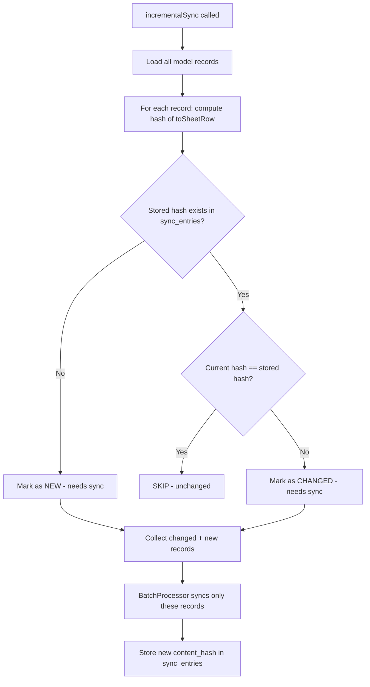
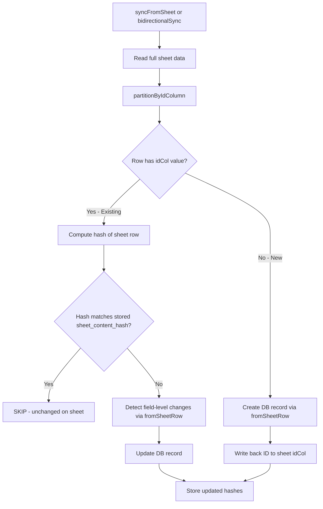
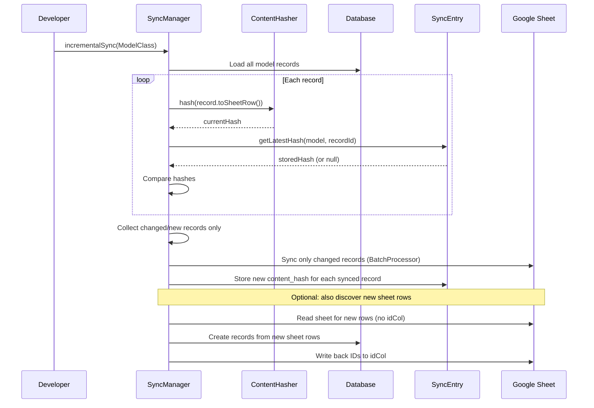
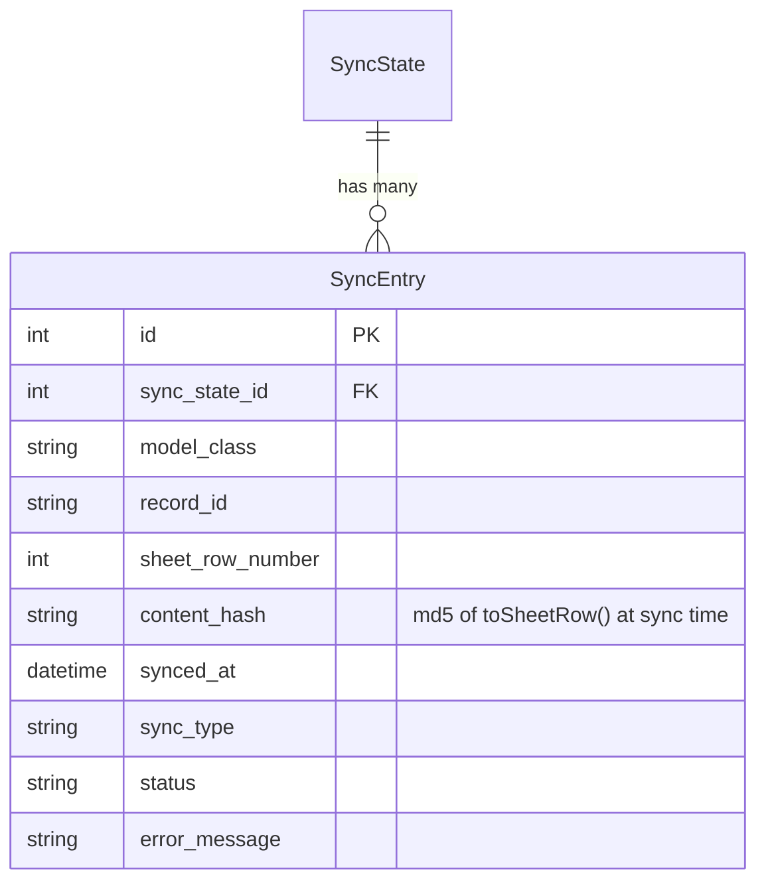

# Content Hash Change Detection for Incremental Sync

**Date**: 2026-09-27  
**Status**: Implementation  
**Relates to**: Bidirectional sync, partial sync, change detection

## Problem Statement

### Failure Case 1: Partial Sync Has No Change Detection

Current `partialSync()` pushes specific record IDs from DB→Sheet without checking if content actually changed. There's no mechanism to determine "which rows changed since last sync" — the system re-syncs everything blindly.

For developers wanting incremental sync (only process changed rows), the current design forces a full sheet read every time, which:
- Wastes Google Sheets API quota
- Becomes slow on large sheets (1000+ rows)
- Cannot scale to scheduled syncs (cron every 5 min)

### Failure Case 2: New Sheet Rows Silently Ignored

When someone manually adds rows to the sheet (without a DB ID in `idCol`):
- `fullSync(direction: 'to_sheet')` → never reads the sheet → new rows invisible
- `partialSync()` → processes only specified record IDs → new rows invisible
- Only `syncFromSheet()` and `bidirectionalSync()` discover new sheet rows

## Solution: Content Hashing

Store a deterministic hash of each record's `toSheetRow()` output in `sync_entries.content_hash`. On subsequent syncs, compare the current hash against the stored hash to detect changes.

### Hash Strategy

```
content_hash = md5(json_encode(normalize(toSheetRow())))
```

- `normalize()`: trim strings, cast numerics, sort keys (for associative arrays)
- `md5` chosen for speed — this is change detection, not security
- Hash is computed from `toSheetRow()` output only (the canonical representation)

### Why Hash Over `updated_at`

| Criterion | `updated_at` | Content Hash |
|-----------|-------------|--------------|
| Detects actual content change | No (timestamp updates on any save) | Yes |
| Works without timestamp column | No | Yes |
| Works for sheet-side changes | No | Yes (hash sheet row too) |
| Performance | O(1) lookup | O(n) compute, but cheap |
| Storage | None extra | 32 chars per entry |

Content hash is strictly more reliable. `updated_at` is a fast-path optimization that can be added later as an optional shortcut.

## Architecture

### Content Hash Flow (DB→Sheet)



### Sheet→DB Change Detection



### Incremental Sync Sequence



### SyncEntry with Content Hash



## Implementation Plan

### 1. Migration: Add `content_hash` to `sync_entries`

```php
Schema::table('sync_entries', function (Blueprint $table) {
    $table->string('content_hash', 32)->nullable()->after('sheet_row_number');
});
```

### 2. New Service: `ContentHasher`

```php
class ContentHasher
{
    public function hash(array $row): string;           // Normalize + md5
    public function hasChanged(string $current, ?string $stored): bool;
    public function getStoredHash(string $modelClass, $recordId): ?string;
}
```

### 3. StateManager Changes

- `recordBatchSync()` accepts optional `$contentHash` per record
- New: `getLatestHashes(string $modelClass, array $recordIds): array` — bulk lookup

### 4. SyncManager: `incrementalSync()`

- Computes hash for all records
- Compares against stored hashes
- Syncs only changed/new records
- For bidirectional: also discovers new sheet rows

### 5. Tests

- Hash consistency (same input → same hash)
- Hash sensitivity (different input → different hash)
- Incremental sync skips unchanged records
- Incremental sync catches changed records
- New sheet rows discovered in incremental mode
